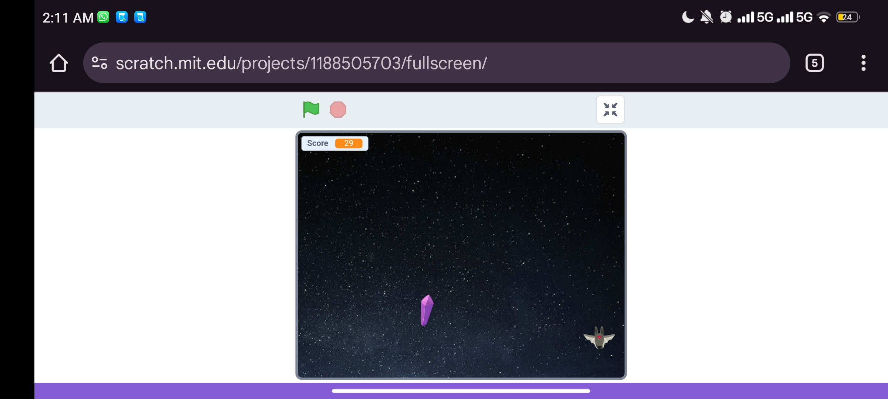

# 💎Nano and the crystal 

This is my first game using **Scratch**, created as part of the **CS50x course**.

In this game, Nano collects crystals 💎 in space while escaping from an evil bat 🦇.

## 🎮 Play the Game
👉 [Click here to play the game on Scratch](https://scratch.mit.edu/projects/1188505703).

## 🧠 Tools Used
- Scratch (block-based visual programming)
- Logic design, event-based actions, sounds

## 📸 Screenshot

## 📝 Credits
Game created by Haneen Khalid 🌟  
Inspired by CS50 – Introduction to Computer Science
